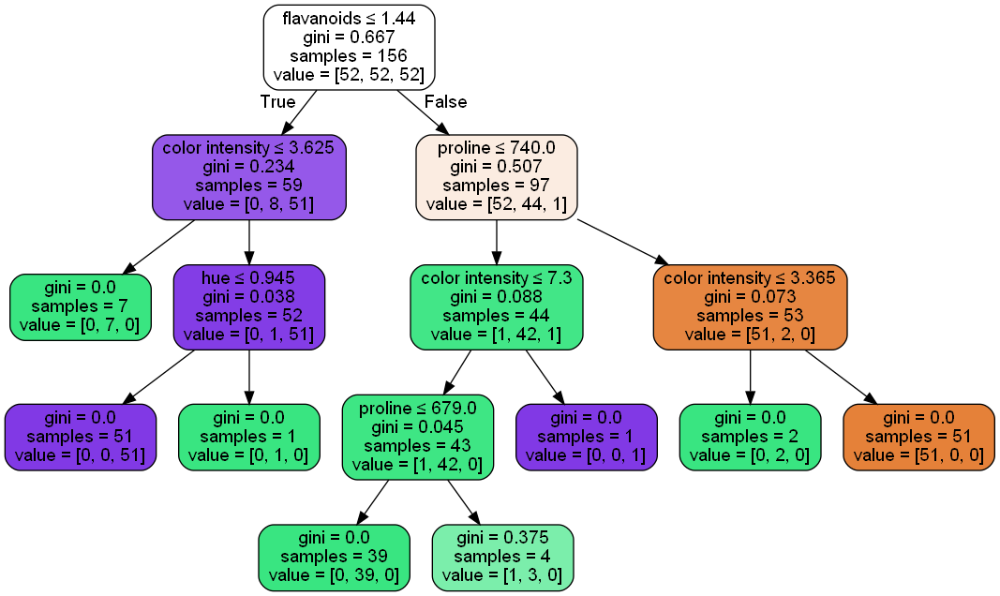
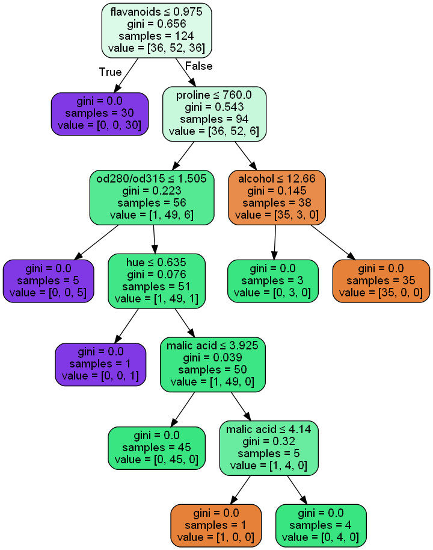

```python
import numpy as np
import pandas as pd

from sklearn.tree import DecisionTreeClassifier
from sklearn.model_selection import  StratifiedKFold,train_test_split
from sklearn.metrics import f1_score, precision_score, recall_score, accuracy_score

from imblearn.over_sampling import SMOTE

#Three print
from sklearn.tree import export_graphviz
from six import StringIO  
from IPython.display import Image  
import pydotplus
```


```python
df = pd.read_csv("wine.csv", delimiter=";")
del df['ash']
X = df.loc[:, df.columns != "class"]
y = df["class"]
X_train, X_test, y_train, y_test = train_test_split(X, y, test_size = 0.3)
```


```python
criterion=['gini','entropy'] 
min_samples_split = [2,3,4,5,6,7,8]
max_depth = [1,2,3,4,5,6,10,15,20] 
class_weight=['balanced', None]

scores_smote = pd.DataFrame({'c': [], 'min': [], 'max': [], 'cl':[], 'accuracy': []})

for c in criterion:
    for mi in min_samples_split :
        for ma in max_depth:
            for cl in class_weight:
                acc = []
                clf = DecisionTreeClassifier(criterion = c, min_samples_split=mi, max_depth=ma,class_weight=cl)
                kf = StratifiedKFold(n_splits=5)
                for fold, (train_index, val_index) in enumerate(kf.split(X_train, y_train), 1):  
                    y_train_fold = y_train.iloc[train_index]  
                    X_train_fold = X_train.iloc[train_index]
                    X_val_fold = X_train.iloc[val_index]
                    y_val_fold = y_train.iloc[val_index]  

                    sm = SMOTE()
                    X_train_fold_oversampled, y_train_fold_oversampled = sm.fit_resample(X_train_fold, y_train_fold)

                    clf.fit(X_train_fold_oversampled, y_train_fold_oversampled )  
                    y_pred_fold = clf.predict(X_val_fold)
                    acc.append(accuracy_score(y_val_fold, y_pred_fold))
                scores_smote = scores_smote.append(pd.Series({'c': c, 'min': mi, 'max' : ma, 'cl':cl, 'accuracy': np.mean(acc)}), ignore_index = True)

best_config = scores_smote.iloc[scores_smote['accuracy'].idxmax()]
print(f"Best configuration WITH SMOTE:\n{best_config}")
best_c = best_config['c']
best_mi = best_config['min']
best_ma = best_config['max']
best_cl = best_config['cl']
```

    Best configuration WITH SMOTE:
    c            gini
    min           5.0
    max          20.0
    cl           None
    accuracy    0.959
    Name: 71, dtype: object
    


```python
best_clf = DecisionTreeClassifier(criterion = best_c, min_samples_split=int(best_mi), max_depth=int(best_ma), class_weight=best_cl)

sm = SMOTE()
X_train_oversampled, y_train_oversampled = sm.fit_resample(X_train, y_train)
best_clf.fit(X_train_oversampled, y_train_oversampled)

y_pred = best_clf.predict(X_test)
print("DECISION TREE EVALUATION WITH SMOTE")
print("Accuracy %f"%accuracy_score(y_test, y_pred))
print("Precision %f"%precision_score(y_test, y_pred,average="weighted",labels=np.unique(y_pred)))
print("Recall %f"%recall_score(y_test, y_pred,average="weighted",labels=np.unique(y_pred)))
print("F1-Score %f"%f1_score(y_test, y_pred,average="weighted",labels=np.unique(y_pred)))
    
dot_data=StringIO()
export_graphviz(best_clf, out_file=dot_data, filled=True, rounded=True, special_characters = True, feature_names =X_train.columns.values.tolist())

graph = pydotplus.graph_from_dot_data(dot_data.getvalue())
graph.write_png("wineDTC_sm.png")
Image(graph.create_png())
```

    DECISION TREE EVALUATION WITH SMOTE
    Accuracy 0.944444
    Precision 0.946296
    Recall 0.944444
    F1-Score 0.944754
    


    

    


```python
criterion=['gini','entropy'] 
min_samples_split = [2,3,4,5,6,7,8]
max_depth = [1,2,3,4,5,6,10,15,20] 
class_weight=['balanced', None]

scores = pd.DataFrame({'c': [], 'min': [], 'max': [], 'cl':[], 'accuracy': []})

for c in criterion:
    for mi in min_samples_split :
        for ma in max_depth:
            for cl in class_weight:
                acc = []
                clf = DecisionTreeClassifier(criterion = c, min_samples_split=mi, max_depth=ma,class_weight=cl)
                kf = StratifiedKFold(n_splits=5)
                for fold, (train_index, val_index) in enumerate(kf.split(X_train, y_train), 1):  
                    y_train_fold = y_train.iloc[train_index]  
                    X_train_fold = X_train.iloc[train_index]
                    X_val_fold = X_train.iloc[val_index]
                    y_val_fold = y_train.iloc[val_index]  

                    clf.fit(X_train_fold, y_train_fold)  
                    y_pred_fold = clf.predict(X_val_fold)
                    acc.append(accuracy_score(y_val_fold, y_pred_fold))
                scores = scores.append(pd.Series({'c': c, 'min': mi, 'max' : ma, 'cl':cl, 'accuracy': np.mean(acc)}), ignore_index = True)

best_config = scores.iloc[scores['accuracy'].idxmax()]
print(f"Best configuration WITHOUT SMOTE:\n{best_config}")
best_c = best_config['c']
best_mi = best_config['min']
best_ma = best_config['max']
best_cl = best_config['cl']
```

    Best configuration WITHOUT SMOTE:
    c               gini
    min              4.0
    max             15.0
    cl              None
    accuracy    0.951667
    Name: 51, dtype: object
    


```python
best_clf = DecisionTreeClassifier(criterion = best_c, min_samples_split=int(best_mi), max_depth=int(best_ma), class_weight=best_cl)
best_clf.fit(X_train, y_train)

y_pred = best_clf.predict(X_test)
print("DECISION TREE EVALUATION WITHOUT SMOTE")
print("Accuracy %f"%accuracy_score(y_test, y_pred))
print("Precision %f"%precision_score(y_test, y_pred,average="weighted",labels=np.unique(y_pred)))
print("Recall %f"%recall_score(y_test, y_pred,average="weighted",labels=np.unique(y_pred)))
print("F1-Score %f"%f1_score(y_test, y_pred,average="weighted",labels=np.unique(y_pred)))
    
dot_data=StringIO()
export_graphviz(best_clf, out_file=dot_data, filled=True, rounded=True, special_characters = True, feature_names =X_train.columns.values.tolist())

graph = pydotplus.graph_from_dot_data(dot_data.getvalue())
graph.write_png("wineDTC.png")
Image(graph.create_png())
```

    DECISION TREE EVALUATION WITHOUT SMOTE
    Accuracy 0.944444
    Precision 0.944840
    Recall 0.944444
    F1-Score 0.944064
    


    

    


