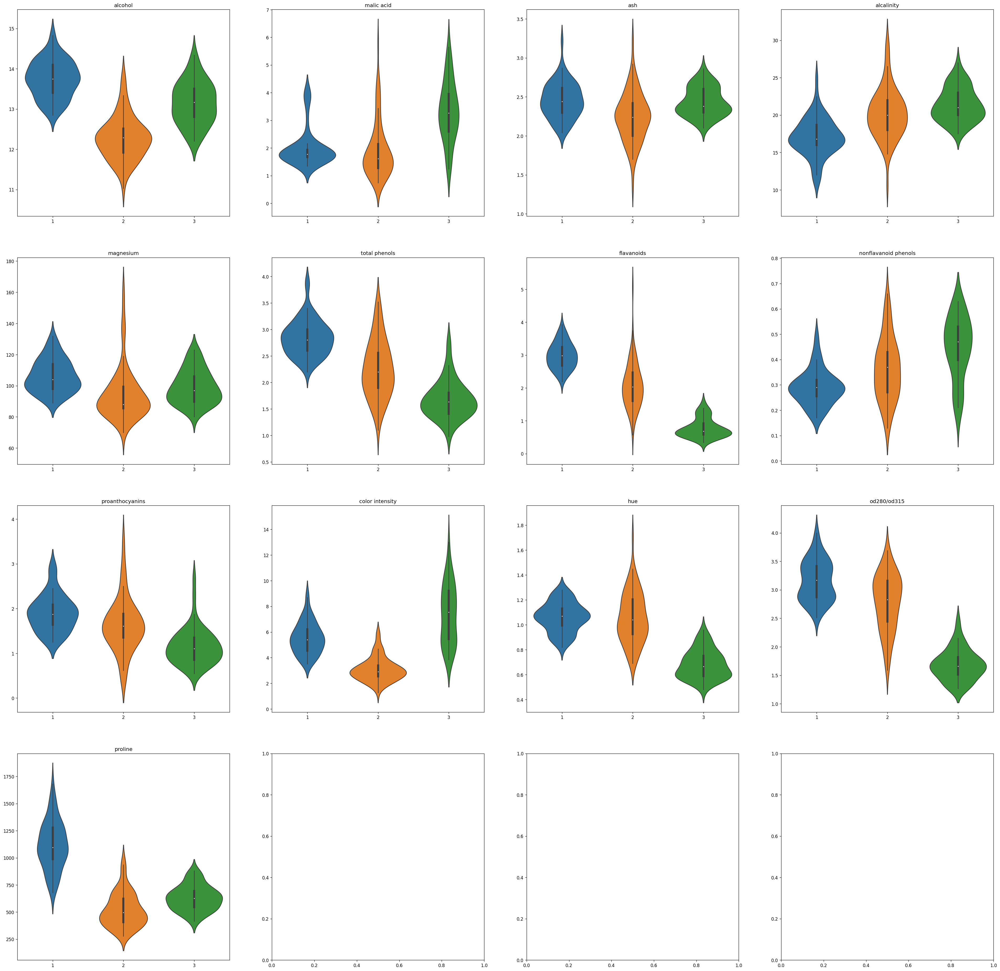
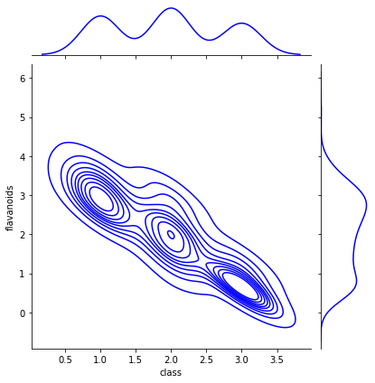
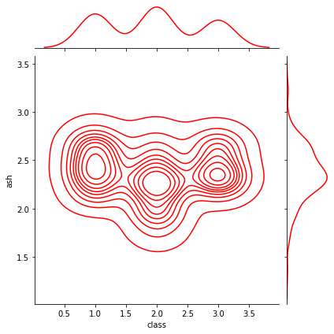
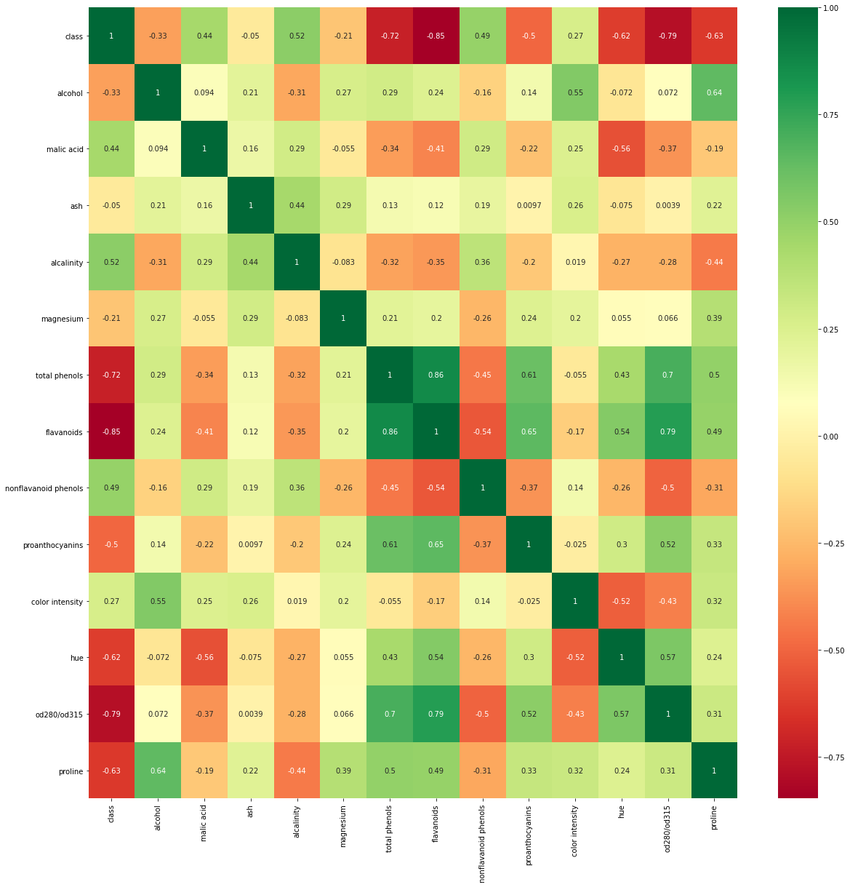
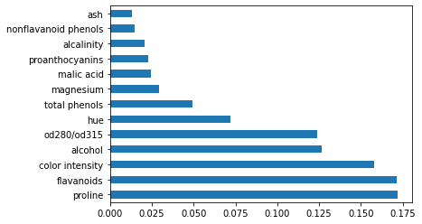

```python
import numpy as np
import pandas as pd
import seaborn as sns
from matplotlib import pyplot as plt

from sklearn.feature_selection import chi2, SelectKBest
from sklearn.ensemble import RandomForestClassifier
df = pd.read_csv("wine.csv", delimiter=";")
```


```python
display(df)
print(f"the column where at least a column is null are: {sum(df.isnull().sum())}")
print(f"the shape of the dataset is the following: {df.shape}")
count = df.isnull().sum()
print("\nMissing values per column")
print(count.to_string())
```


<div>
<style scoped>
    .dataframe tbody tr th:only-of-type {
        vertical-align: middle;
    }

    .dataframe tbody tr th {
        vertical-align: top;
    }

    .dataframe thead th {
        text-align: right;
    }
</style>
<table border="1" class="dataframe">
  <thead>
    <tr style="text-align: right;">
      <th></th>
      <th>class</th>
      <th>alcohol</th>
      <th>malic acid</th>
      <th>ash</th>
      <th>alcalinity</th>
      <th>magnesium</th>
      <th>total phenols</th>
      <th>flavanoids</th>
      <th>nonflavanoid phenols</th>
      <th>proanthocyanins</th>
      <th>color intensity</th>
      <th>hue</th>
      <th>od280/od315</th>
      <th>proline</th>
    </tr>
  </thead>
  <tbody>
    <tr>
      <th>0</th>
      <td>1</td>
      <td>14.23</td>
      <td>1.71</td>
      <td>2.43</td>
      <td>15.6</td>
      <td>127</td>
      <td>2.80</td>
      <td>3.06</td>
      <td>0.28</td>
      <td>2.29</td>
      <td>5.64</td>
      <td>1.04</td>
      <td>3.92</td>
      <td>1065</td>
    </tr>
    <tr>
      <th>1</th>
      <td>1</td>
      <td>13.20</td>
      <td>1.78</td>
      <td>2.14</td>
      <td>11.2</td>
      <td>100</td>
      <td>2.65</td>
      <td>2.76</td>
      <td>0.26</td>
      <td>1.28</td>
      <td>4.38</td>
      <td>1.05</td>
      <td>3.40</td>
      <td>1050</td>
    </tr>
    <tr>
      <th>2</th>
      <td>1</td>
      <td>13.16</td>
      <td>2.36</td>
      <td>2.67</td>
      <td>18.6</td>
      <td>101</td>
      <td>2.80</td>
      <td>3.24</td>
      <td>0.30</td>
      <td>2.81</td>
      <td>5.68</td>
      <td>1.03</td>
      <td>3.17</td>
      <td>1185</td>
    </tr>
    <tr>
      <th>3</th>
      <td>1</td>
      <td>14.37</td>
      <td>1.95</td>
      <td>2.50</td>
      <td>16.8</td>
      <td>113</td>
      <td>3.85</td>
      <td>3.49</td>
      <td>0.24</td>
      <td>2.18</td>
      <td>7.80</td>
      <td>0.86</td>
      <td>3.45</td>
      <td>1480</td>
    </tr>
    <tr>
      <th>4</th>
      <td>1</td>
      <td>13.24</td>
      <td>2.59</td>
      <td>2.87</td>
      <td>21.0</td>
      <td>118</td>
      <td>2.80</td>
      <td>2.69</td>
      <td>0.39</td>
      <td>1.82</td>
      <td>4.32</td>
      <td>1.04</td>
      <td>2.93</td>
      <td>735</td>
    </tr>
    <tr>
      <th>...</th>
      <td>...</td>
      <td>...</td>
      <td>...</td>
      <td>...</td>
      <td>...</td>
      <td>...</td>
      <td>...</td>
      <td>...</td>
      <td>...</td>
      <td>...</td>
      <td>...</td>
      <td>...</td>
      <td>...</td>
      <td>...</td>
    </tr>
    <tr>
      <th>173</th>
      <td>3</td>
      <td>13.71</td>
      <td>5.65</td>
      <td>2.45</td>
      <td>20.5</td>
      <td>95</td>
      <td>1.68</td>
      <td>0.61</td>
      <td>0.52</td>
      <td>1.06</td>
      <td>7.70</td>
      <td>0.64</td>
      <td>1.74</td>
      <td>740</td>
    </tr>
    <tr>
      <th>174</th>
      <td>3</td>
      <td>13.40</td>
      <td>3.91</td>
      <td>2.48</td>
      <td>23.0</td>
      <td>102</td>
      <td>1.80</td>
      <td>0.75</td>
      <td>0.43</td>
      <td>1.41</td>
      <td>7.30</td>
      <td>0.70</td>
      <td>1.56</td>
      <td>750</td>
    </tr>
    <tr>
      <th>175</th>
      <td>3</td>
      <td>13.27</td>
      <td>4.28</td>
      <td>2.26</td>
      <td>20.0</td>
      <td>120</td>
      <td>1.59</td>
      <td>0.69</td>
      <td>0.43</td>
      <td>1.35</td>
      <td>10.20</td>
      <td>0.59</td>
      <td>1.56</td>
      <td>835</td>
    </tr>
    <tr>
      <th>176</th>
      <td>3</td>
      <td>13.17</td>
      <td>2.59</td>
      <td>2.37</td>
      <td>20.0</td>
      <td>120</td>
      <td>1.65</td>
      <td>0.68</td>
      <td>0.53</td>
      <td>1.46</td>
      <td>9.30</td>
      <td>0.60</td>
      <td>1.62</td>
      <td>840</td>
    </tr>
    <tr>
      <th>177</th>
      <td>3</td>
      <td>14.13</td>
      <td>4.10</td>
      <td>2.74</td>
      <td>24.5</td>
      <td>96</td>
      <td>2.05</td>
      <td>0.76</td>
      <td>0.56</td>
      <td>1.35</td>
      <td>9.20</td>
      <td>0.61</td>
      <td>1.60</td>
      <td>560</td>
    </tr>
  </tbody>
</table>
<p>178 rows × 14 columns</p>
</div>


    the column where at least a column is null are: 0
    the shape of the dataset is the following: (178, 14)
    
    Missing values per column
    class                   0
    alcohol                 0
    malic acid              0
    ash                     0
    alcalinity              0
    magnesium               0
    total phenols           0
    flavanoids              0
    nonflavanoid phenols    0
    proanthocyanins         0
    color intensity         0
    hue                     0
    od280/od315             0
    proline                 0
    


```python
df.info()
```

    <class 'pandas.core.frame.DataFrame'>
    RangeIndex: 178 entries, 0 to 177
    Data columns (total 14 columns):
     #   Column                Non-Null Count  Dtype  
    ---  ------                --------------  -----  
     0   class                 178 non-null    int64  
     1   alcohol               178 non-null    float64
     2   malic acid            178 non-null    float64
     3   ash                   178 non-null    float64
     4   alcalinity            178 non-null    float64
     5   magnesium             178 non-null    int64  
     6   total phenols         178 non-null    float64
     7   flavanoids            178 non-null    float64
     8   nonflavanoid phenols  178 non-null    float64
     9   proanthocyanins       178 non-null    float64
     10  color intensity       178 non-null    float64
     11  hue                   178 non-null    float64
     12  od280/od315           178 non-null    float64
     13  proline               178 non-null    int64  
    dtypes: float64(11), int64(3)
    memory usage: 19.6 KB
    


```python
df.describe()
```


<div>
<style scoped>
    .dataframe tbody tr th:only-of-type {
        vertical-align: middle;
    }

    .dataframe tbody tr th {
        vertical-align: top;
    }

    .dataframe thead th {
        text-align: right;
    }
</style>
<table border="1" class="dataframe">
  <thead>
    <tr style="text-align: right;">
      <th></th>
      <th>class</th>
      <th>alcohol</th>
      <th>malic acid</th>
      <th>ash</th>
      <th>alcalinity</th>
      <th>magnesium</th>
      <th>total phenols</th>
      <th>flavanoids</th>
      <th>nonflavanoid phenols</th>
      <th>proanthocyanins</th>
      <th>color intensity</th>
      <th>hue</th>
      <th>od280/od315</th>
      <th>proline</th>
    </tr>
  </thead>
  <tbody>
    <tr>
      <th>count</th>
      <td>178.000000</td>
      <td>178.000000</td>
      <td>178.000000</td>
      <td>178.000000</td>
      <td>178.000000</td>
      <td>178.000000</td>
      <td>178.000000</td>
      <td>178.000000</td>
      <td>178.000000</td>
      <td>178.000000</td>
      <td>178.000000</td>
      <td>178.000000</td>
      <td>178.000000</td>
      <td>178.000000</td>
    </tr>
    <tr>
      <th>mean</th>
      <td>1.938202</td>
      <td>13.000618</td>
      <td>2.336348</td>
      <td>2.366517</td>
      <td>19.494944</td>
      <td>99.741573</td>
      <td>2.295112</td>
      <td>2.029270</td>
      <td>0.361854</td>
      <td>1.590899</td>
      <td>5.058090</td>
      <td>0.957449</td>
      <td>2.611685</td>
      <td>746.893258</td>
    </tr>
    <tr>
      <th>std</th>
      <td>0.775035</td>
      <td>0.811827</td>
      <td>1.117146</td>
      <td>0.274344</td>
      <td>3.339564</td>
      <td>14.282484</td>
      <td>0.625851</td>
      <td>0.998859</td>
      <td>0.124453</td>
      <td>0.572359</td>
      <td>2.318286</td>
      <td>0.228572</td>
      <td>0.709990</td>
      <td>314.907474</td>
    </tr>
    <tr>
      <th>min</th>
      <td>1.000000</td>
      <td>11.030000</td>
      <td>0.740000</td>
      <td>1.360000</td>
      <td>10.600000</td>
      <td>70.000000</td>
      <td>0.980000</td>
      <td>0.340000</td>
      <td>0.130000</td>
      <td>0.410000</td>
      <td>1.280000</td>
      <td>0.480000</td>
      <td>1.270000</td>
      <td>278.000000</td>
    </tr>
    <tr>
      <th>25%</th>
      <td>1.000000</td>
      <td>12.362500</td>
      <td>1.602500</td>
      <td>2.210000</td>
      <td>17.200000</td>
      <td>88.000000</td>
      <td>1.742500</td>
      <td>1.205000</td>
      <td>0.270000</td>
      <td>1.250000</td>
      <td>3.220000</td>
      <td>0.782500</td>
      <td>1.937500</td>
      <td>500.500000</td>
    </tr>
    <tr>
      <th>50%</th>
      <td>2.000000</td>
      <td>13.050000</td>
      <td>1.865000</td>
      <td>2.360000</td>
      <td>19.500000</td>
      <td>98.000000</td>
      <td>2.355000</td>
      <td>2.135000</td>
      <td>0.340000</td>
      <td>1.555000</td>
      <td>4.690000</td>
      <td>0.965000</td>
      <td>2.780000</td>
      <td>673.500000</td>
    </tr>
    <tr>
      <th>75%</th>
      <td>3.000000</td>
      <td>13.677500</td>
      <td>3.082500</td>
      <td>2.557500</td>
      <td>21.500000</td>
      <td>107.000000</td>
      <td>2.800000</td>
      <td>2.875000</td>
      <td>0.437500</td>
      <td>1.950000</td>
      <td>6.200000</td>
      <td>1.120000</td>
      <td>3.170000</td>
      <td>985.000000</td>
    </tr>
    <tr>
      <th>max</th>
      <td>3.000000</td>
      <td>14.830000</td>
      <td>5.800000</td>
      <td>3.230000</td>
      <td>30.000000</td>
      <td>162.000000</td>
      <td>3.880000</td>
      <td>5.080000</td>
      <td>0.660000</td>
      <td>3.580000</td>
      <td>13.000000</td>
      <td>1.710000</td>
      <td>4.000000</td>
      <td>1680.000000</td>
    </tr>
  </tbody>
</table>
</div>


```python
fig, axs = plt.subplots(nrows=4, ncols=4, figsize=(40,40), dpi=120)
for ind, feature in enumerate(df.keys()[1:]):
    row = ind/4
    column = ind%4
    fig = sns.violinplot(data=df, y=feature,
        ax=axs[int(row)][column],
    x='class').set_title(feature)
    axs[int(row)][column].set_xlabel("")
    axs[int(row)][column].set_ylabel("")
plt.show()
```


    

    


```python
sns.jointplot(data=df, x="class", y="flavanoids", color="blue", kind="kde")
sns.jointplot(data=df, x="class", y="ash", color="red", kind="kde")
```


    <seaborn.axisgrid.JointGrid at 0x24fcdd2e9a0>


    

    


    

    


```python
corrmat = df.corr()
top_corr_feat = corrmat.index
plt.figure(figsize=(20,20))
g= sns.heatmap(df[top_corr_feat].corr(), annot=True,cmap="RdYlGn")
```


    

    


```python
X = df.loc[:, df.columns != "class"]
y = df["class"]
bestfeatures = SelectKBest(score_func=chi2, k=4)
fit = bestfeatures.fit(X,y)
dfscores = pd.DataFrame(fit.scores_)
dfcol= pd.DataFrame(X.columns)
featureScores = pd.concat([dfcol,dfscores],axis=1)
featureScores.columns = ['Feature','Chi2-Score']
print(featureScores.nlargest(13,'Chi2-Score'))
```

                     Feature    Chi2-Score
    12               proline  16540.067145
    9        color intensity    109.016648
    6             flavanoids     63.334308
    4              magnesium     45.026381
    3             alcalinity     29.383695
    1             malic acid     28.068605
    11           od280/od315     23.389883
    5          total phenols     15.623076
    8        proanthocyanins      9.368283
    0                alcohol      5.445499
    10                   hue      5.182540
    7   nonflavanoid phenols      1.815485
    2                    ash      0.743381
    


```python
model = RandomForestClassifier()
model.fit(X,y)
print(model.feature_importances_)
feat_imp=pd.Series(model.feature_importances_, index=X.columns)
feat_imp.nlargest(13).plot(kind='barh')
plt.show()
```

    [0.1266543  0.02475783 0.01342288 0.02087399 0.02920494 0.04961404
     0.1714761  0.01487407 0.0230226  0.15772743 0.0721685  0.1240693
     0.17213401]
    


    

    

